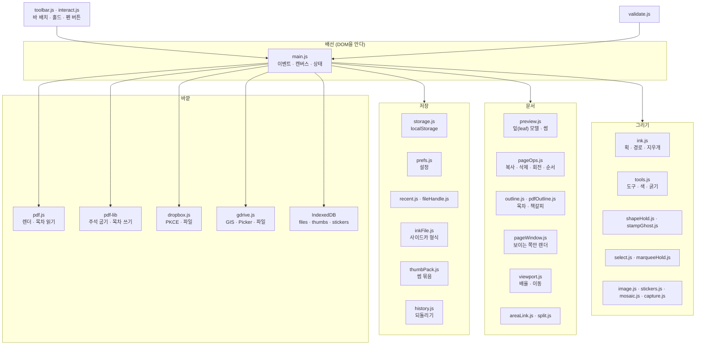
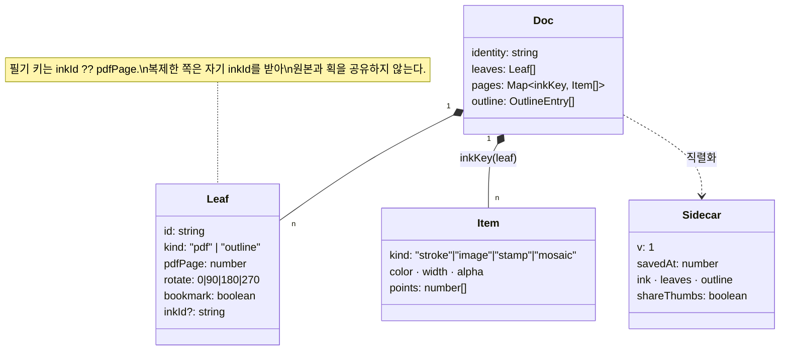
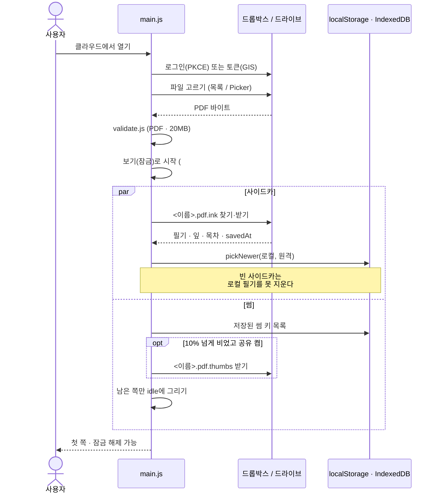
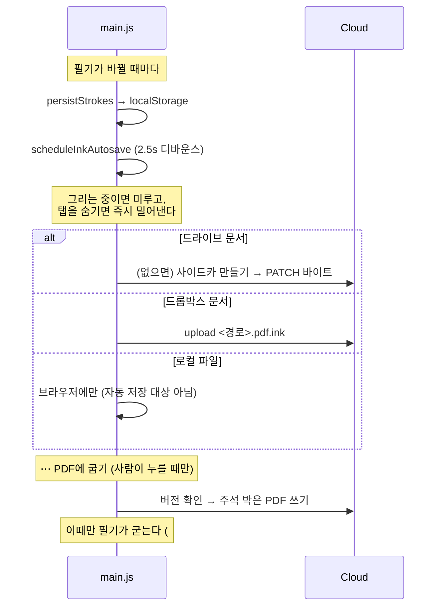

# 구조 (UML)

바닐라 JS + Vite. 프레임워크가 없고, **순수 모듈 + 얇은 배선** 두 층입니다.
`src/main.js`가 DOM·이벤트·클라우드 호출을 붙이고, 나머지 모듈은 DOM을 모른 채 계산만 해서 `node --test`로 못 박습니다.

## 1. 컴포넌트



규칙: **모듈끼리는 얕게만 부르고**(`pageOps → preview`처럼), 순환은 만들지 않습니다. `src/imports.test.js`가 「안 들여온 함수 호출」과 「없는 이름 들여오기」를 빌드 전에 잡습니다.

## 2. 문서 모델



## 3. 열기 — 클라우드 문서



## 4. 저장 — 세 갈래



## 5. 도구 상태

```mermaid
stateDiagram-v2
  [*] --> 보기 : 문서를 열면 잠금 (#127)
  보기 --> 편집 : 잠금 해제
  편집 --> 보기 : 잠금

  state 편집 {
    [*] --> 펜
    펜 --> 형광 --> 색연필 --> 펜
    펜 --> 지우개 : 도구 / 펜 버튼
    지우개 --> 펜 : 버튼을 떼면
    펜 --> 선택
    선택 --> 펜
    펜 --> 스탬프

    state 펜 {
      [*] --> 그리는중 : pointerdown
      그리는중 --> 도형칩 : 끝에서 400ms 정지
      도형칩 --> [*] : 칩을 고르면 도형
      도형칩 --> [*] : 안 고르면 손 획
      그리는중 --> [*] : pointerup
    }
  }
```

`펜 → 지우개`는 도구를 바꾸지 않고 그 획만 지우개로 만듭니다(펜 배럴 버튼). 지우개 꼭지는 배정과 무관하게 언제나 지우개입니다.

## 6. 왜 이렇게

- **모듈은 DOM을 모른다** — 그래야 `node --test`로 브라우저 없이 계약을 못 박고, 회귀가 PR 전에 잡힙니다.
- **사이드카가 기본, 굽기는 선택** — 획은 좌표라 KB고, PDF를 다시 쓰면 필기가 굳습니다. 자동 저장은 굳히면 안 됩니다.
- **덮어쓰지 않는다** — 드롭박스는 `rev` update, 드라이브는 `version` 확인 후 쓰기, 다른 이름으로 저장은 `add + autorename`.
- **쪽 창(window) 렌더** — 400쪽에서도 보이는 쪽만 캔버스를 답니다.
- **한 획은 한 캔버스** — 그리는 동안은 `liveCanvas`에만 얹어, 쌓인 필기와 무관하게 프레임 비용이 일정합니다.
