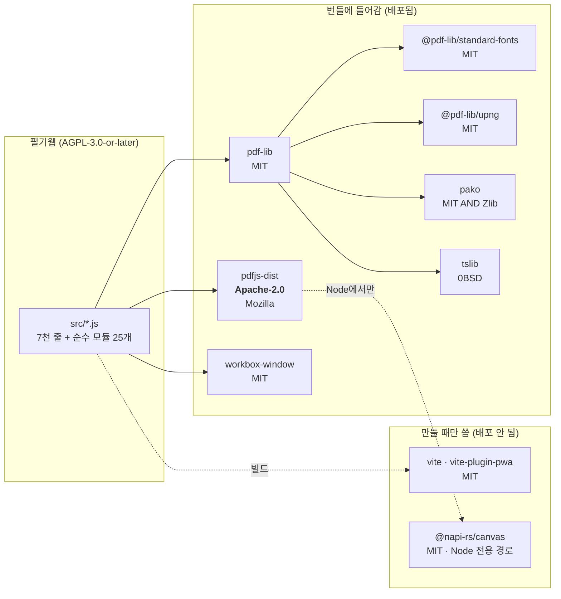
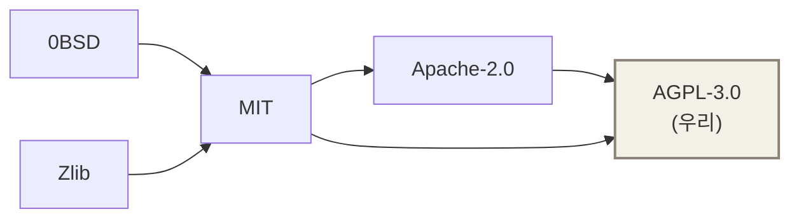

# 라이선스 관계도

필기웹은 **AGPL-3.0-or-later**입니다. 그 안에 다른 사람들의 코드가 함께 실려 나갑니다.
결론부터: **전부 문제없습니다.** 방향이 맞기 때문입니다.

## 1. 무엇이 실려 나가는가

`@napi-rs/canvas`는 pdf.js가 **Node에서 렌더할 때만** 부르는 경로입니다. 브라우저 번들에는 그 이름을 부르는 문자열만 남고 코드는 들어가지 않습니다.

## 2. 왜 섞어도 되는가 — 방향

호환은 **한쪽 방향으로만** 흐릅니다. 느슨한 것을 엄한 것 **안에** 넣는 것은 되고, 반대는 안 됩니다.

- **MIT·0BSD·Zlib → AGPL**: 문제없음. 조건은 「저작권 표시를 남겨라」 하나뿐입니다.
- **Apache-2.0 → AGPLv3**: 문제없음. 다만 **v3에서만** 됩니다 — Apache-2.0은 GPL**v2**와는 호환되지 않습니다(특허 조항 때문). 우리는 v3이라 해당 없습니다.
- **반대 방향은 안 됩니다.** 남이 우리 코드를 MIT 프로젝트에 넣을 수는 없습니다. 그게 AGPL을 고른 이유입니다.

우리가 AGPL을 골랐다고 해서 **pdf.js가 AGPL이 되는 것은 아닙니다.** 그들의 코드는 그들 라이선스 그대로이고, 합쳐진 결과물(필기웹)의 배포 조건이 AGPL일 뿐입니다.

## 3. 그래서 우리가 지켜야 하는 것

| 의무 | 어디서 지키나 |
|---|---|
| 저작권·라이선스 표시를 함께 배포 (MIT·Apache §4) | `public/THIRD-PARTY-NOTICES.txt` — 앱의 **다른 코드** 링크 |
| 아파치 라이선스 전문 제공 (Apache §4a) | 같은 파일에 전문 그대로 |
| 쓰는 사람에게 소스 제공 (AGPL §13) | 앱의 **소스** 링크 |

번들은 압축되면서 주석이 지워집니다. pdf.js **워커**는 통째로 복사돼 아파치 헤더가 살아남지만, 묶여 압축된 청크에서는 사라집니다. 그래서 표시가 **파일 하나에 모여** 앱에서 바로 열립니다.

의존성이 바뀌면 `npm run notices`로 다시 만듭니다. `src/notices.test.js`가 목록이 어긋나면 잡습니다.

## 4. 남이 우리 것을 가져갈 때

포크는 자유입니다. 다만 AGPL이라 **고쳐서 웹으로 서비스하면 그 소스도 같은 라이선스로 공개**해야 합니다. 그리고 **「필기웹」·「pdf-ink」라는 이름과 아이콘은 라이선스에 포함되지 않습니다** — 포크는 다른 이름을 쓰세요.
